# EPL Deep Production Gap Analysis

Comprehensive audit of 12+ subsystems. Gaps ordered by severity.

---

## 🔴 CRITICAL — Security

| # | Gap | File | Impact |
|---|-----|------|--------|
| 1 | **Pickle deserialization on untrusted data** | `bytecode_cache.py:74`, `deploy.py:774` | `pickle.loads()` can execute arbitrary code. An attacker could craft a malicious [.eplc](file:///c:/Users/lenovo/Desktop/EPL%28programming%20language%29/tests/_tmp_todo_app.eplc) file to gain full system access. |
| 2 | **No recursion depth limit** | [interpreter.py](file:///c:/Users/lenovo/Desktop/EPL%28programming%20language%29/epl/interpreter.py), [environment.py](file:///c:/Users/lenovo/Desktop/EPL%28programming%20language%29/epl/environment.py) | No `sys.setrecursionlimit()` or manual call-stack depth check. Infinite recursion crashes the process with a Python `RecursionError` instead of a clean EPL error. |
| 3 | **FFI has no sandbox** | [ffi.py](file:///c:/Users/lenovo/Desktop/EPL%28programming%20language%29/epl/ffi.py) | [ffi_open()](file:///c:/Users/lenovo/Desktop/EPL%28programming%20language%29/epl/ffi.py#168-198) can load ANY shared library and call ANY function. No allowlist, no `safe_mode` gating. |

> [!CAUTION]
> Gap #1 is a **Remote Code Execution vulnerability**. Any [.eplc](file:///c:/Users/lenovo/Desktop/EPL%28programming%20language%29/tests/_tmp_todo_app.eplc) file could be weaponized.

---

## 🟠 HIGH — Reliability & Error Handling

| # | Gap | File | Impact |
|---|-----|------|--------|
| 4 | **VM silently fallbacks to interpreter** | `main.py:229-232` | VM failures are silently caught and fall through. Users don't know which engine actually ran their code. |
| 5 | **`_source_lines` is global mutable state** | `errors.py:129-130` | Multi-threaded execution (e.g., web server) will corrupt error source context across requests. |
| 6 | **Environment scope chain has no depth limit** | [environment.py](file:///c:/Users/lenovo/Desktop/EPL%28programming%20language%29/epl/environment.py) | Deeply nested closures/functions create unbounded scope chains → memory leaks and slow lookups. |
| 7 | **[async_io.py](file:///c:/Users/lenovo/Desktop/EPL%28programming%20language%29/epl/async_io.py) has duplicate [EPLChannel](file:///c:/Users/lenovo/Desktop/EPL%28programming%20language%29/epl/async_io.py#125-162)/[EPLTimer](file:///c:/Users/lenovo/Desktop/EPL%28programming%20language%29/epl/concurrency.py#321-359) classes** | [async_io.py](file:///c:/Users/lenovo/Desktop/EPL%28programming%20language%29/epl/async_io.py) vs [concurrency.py](file:///c:/Users/lenovo/Desktop/EPL%28programming%20language%29/epl/concurrency.py) | Two competing implementations of Channels and Timers — confusing and inconsistent API. |
| 8 | **No graceful shutdown for event loop** | `async_io.py:68-74` | `EPLEventLoop.shutdown()` doesn't drain pending tasks, may drop work. |
| 9 | **[RWLock](file:///c:/Users/lenovo/Desktop/EPL%28programming%20language%29/epl/concurrency.py#64-93) has writer starvation** | `concurrency.py:64-92` | Continuous readers can starve waiting writers indefinitely. No priority fairness. |

---

## 🟡 MEDIUM — Testing & Quality

| # | Gap | File | Impact |
|---|-----|------|--------|
| 10 | **No `epl test` auto-discovery for [.epl](file:///c:/Users/lenovo/Desktop/EPL%28programming%20language%29/_tmp_test.epl) test files** | [cli.py](file:///c:/Users/lenovo/Desktop/EPL%28programming%20language%29/epl/cli.py) | `epl test` doesn't auto-discover `test_*.epl` files like pytest does for `test_*.py`. |
| 11 | **Test framework isn't wired to `epl test` command** | [test_framework.py](file:///c:/Users/lenovo/Desktop/EPL%28programming%20language%29/epl/test_framework.py) ↔ [cli.py](file:///c:/Users/lenovo/Desktop/EPL%28programming%20language%29/epl/cli.py) | The EPL test runner exists but isn't invoked by the CLI's [test](file:///c:/Users/lenovo/Desktop/EPL%28programming%20language%29/epl/cli.py#569-578) command. |
| 12 | **62 Python test files, 0 [.epl](file:///c:/Users/lenovo/Desktop/EPL%28programming%20language%29/_tmp_test.epl) test files** | [tests/](file:///c:/Users/lenovo/Desktop/EPL%28programming%20language%29/epl/cli.py#569-578) | All tests are written in Python. No self-hosted tests prove EPL can test EPL code. |
| 13 | **No code coverage integration** | [test_framework.py](file:///c:/Users/lenovo/Desktop/EPL%28programming%20language%29/epl/test_framework.py) | Coverage tracking is listed as a feature but not implemented. |
| 14 | **[AssertionError](file:///c:/Users/lenovo/Desktop/EPL%28programming%20language%29/epl/test_framework.py#105-108) typo (should be [AssertionError](file:///c:/Users/lenovo/Desktop/EPL%28programming%20language%29/epl/test_framework.py#105-108) → [AssertionError](file:///c:/Users/lenovo/Desktop/EPL%28programming%20language%29/epl/test_framework.py#105-108))** | `errors.py:414`, `test_framework.py:105` | Consistent typo [Assertion](file:///c:/Users/lenovo/Desktop/EPL%28programming%20language%29/epl/test_framework.py#105-108) → `Assertation`. Not a bug (consistently used), but looks unprofessional. |

---

## 🟡 MEDIUM — Performance

| # | Gap | File | Impact |
|---|-----|------|--------|
| 15 | **VM missing feature parity** → frequent silent fallback | `vm.py:638-662` | Web/GUI/many DSL nodes trigger [VMError](file:///c:/Users/lenovo/Desktop/EPL%28programming%20language%29/epl/vm.py#180-185) and fall back to interpreter. Users get 10-50x slowdown without knowing why. |
| 16 | **No bytecode cache for VM** | [vm.py](file:///c:/Users/lenovo/Desktop/EPL%28programming%20language%29/epl/vm.py), [bytecode_cache.py](file:///c:/Users/lenovo/Desktop/EPL%28programming%20language%29/epl/bytecode_cache.py) | Bytecode cache stores AST (parser output), not VM bytecode. Every run re-compiles AST → bytecode. |
| 17 | **Constant folding missing from VM optimizer** | [vm.py](file:///c:/Users/lenovo/Desktop/EPL%28programming%20language%29/epl/vm.py) | Peephole optimizer handles NOT+JUMP and dead self-assigns, but doesn't fold `2 + 3` → `5` at compile time. |

---

## 🔵 LOW — Developer Experience

| # | Gap | File | Impact |
|---|-----|------|--------|
| 18 | **No `epl fmt` command** | [cli.py](file:///c:/Users/lenovo/Desktop/EPL%28programming%20language%29/epl/cli.py), [formatter.py](file:///c:/Users/lenovo/Desktop/EPL%28programming%20language%29/epl/formatter.py) | Formatter exists but has no CLI command. Users can't format files from terminal. |
| 19 | **No `epl lint` command** | [cli.py](file:///c:/Users/lenovo/Desktop/EPL%28programming%20language%29/epl/cli.py), [doc_linter.py](file:///c:/Users/lenovo/Desktop/EPL%28programming%20language%29/epl/doc_linter.py) | Linter exists but has no CLI command for standalone linting. |
| 20 | **REPL duplicate history setup** | `main.py:537-554` | The REPL sets up readline history **twice** (identical code block duplicated). |
| 21 | **No `epl upgrade` / self-update** | [cli.py](file:///c:/Users/lenovo/Desktop/EPL%28programming%20language%29/epl/cli.py) | No way to update EPL from the CLI itself. |

---

## 🔵 LOW — Ecosystem

| # | Gap | File | Impact |
|---|-----|------|--------|
| 22 | **Package lockfile not implemented** | [package_manager.py](file:///c:/Users/lenovo/Desktop/EPL%28programming%20language%29/epl/package_manager.py) | Manifest parsing works but `epl.lock` for reproducible builds is missing. |
| 23 | **No package publish verification** | [publisher.py](file:///c:/Users/lenovo/Desktop/EPL%28programming%20language%29/epl/publisher.py) | `epl publish` doesn't verify package integrity (checksums) before upload. |
| 24 | **No `epl doc` command** | [cli.py](file:///c:/Users/lenovo/Desktop/EPL%28programming%20language%29/epl/cli.py) | No auto-generated API documentation from EPL source files. |

---

## Recommended Fix Priority

```mermaid
graph TD
    A["🔴 P0: Security"] --> A1["Fix pickle → use JSON/msgpack"]
    A --> A2["Add recursion depth limit"]
    A --> A3["Gate FFI behind safe_mode"]
    
    B["🟠 P1: Reliability"] --> B1["Thread-local source context"]
    B --> B2["Merge duplicate Channel/Timer"]
    B --> B3["Add scope depth limit"]
    
    C["🟡 P2: Testing"] --> C1["Wire epl test → test_framework"]
    C --> C2["Write self-hosted .epl tests"]
    C --> C3["Add epl fmt + epl lint CLIs"]
    
    D["🔵 P3: Polish"] --> D1["Fix REPL duplicate history"]
    D --> D2["Add constant folding to VM"]
    D --> D3["Implement epl.lock"]
```

---

## Quick Wins (< 30 min each)

1. **Add recursion limit** — 3 lines in [interpreter.py](file:///c:/Users/lenovo/Desktop/EPL%28programming%20language%29/epl/interpreter.py)
2. **Fix REPL duplicate history** — Delete the duplicated block in `main.py:547-554`
3. **Gate FFI behind `safe_mode`** — Add `if safe_mode: raise` guard in [ffi.py](file:///c:/Users/lenovo/Desktop/EPL%28programming%20language%29/epl/ffi.py)
4. **Thread-local source context** — Change `errors.py:129-130` to use `threading.local()`
5. **Wire `epl test` to test_framework** — 15 lines in [cli.py](file:///c:/Users/lenovo/Desktop/EPL%28programming%20language%29/epl/cli.py)
6. **Add `epl fmt` and `epl lint` CLI** — 20 lines each in [cli.py](file:///c:/Users/lenovo/Desktop/EPL%28programming%20language%29/epl/cli.py)
